

<a href="https://github.com/fguzman-stack"></a>

  

<a href="https://miportafolio-fguz.vercel.app/">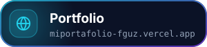</a>

  


  

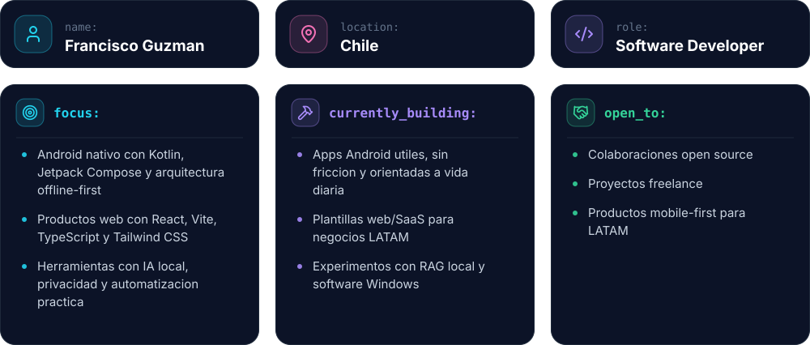

  

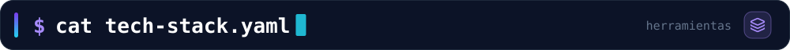
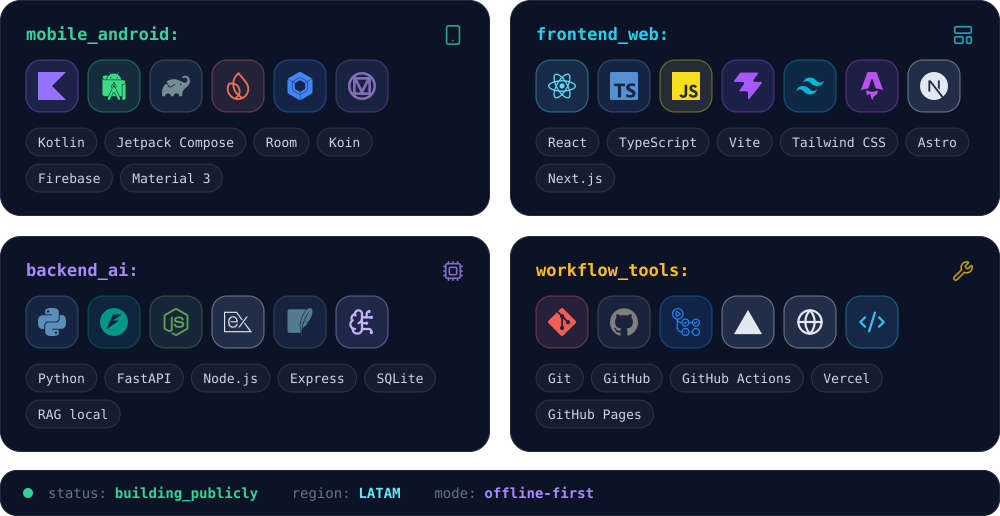

  

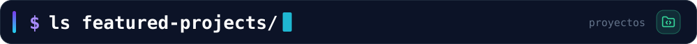

<a href="https://github.com/fguzman-stack/CodePet">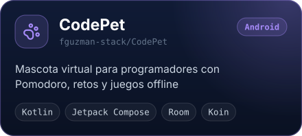</a>
<a href="https://github.com/fguzman-stack/Despensadeldia">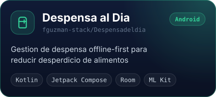</a>
<a href="https://github.com/fguzman-stack/ATiempo">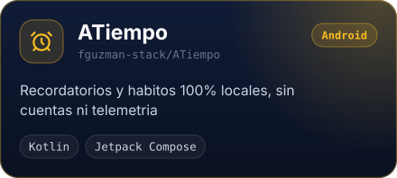</a>
<a href="https://github.com/fguzman-stack/AetherDown">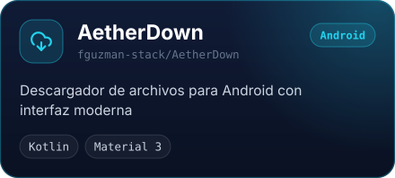</a>
<a href="https://github.com/fguzman-stack/MiPresentacion">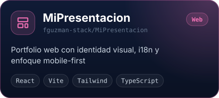</a>
<a href="https://github.com/fguzman-stack/DocuMind-Ai-Web">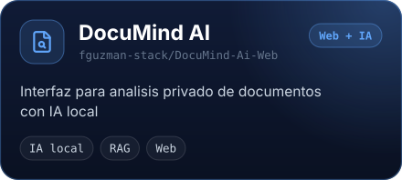</a>

  

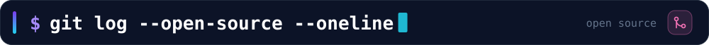

<a href="https://github.com/DDOneApps/Phony/pulls?q=is%3Apr+author%3Afguzman-stack">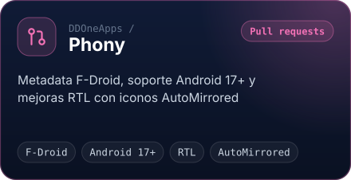</a>
<a href="https://github.com/legalize-dev/legalize-pipeline/pull/137"></a>

Repos: <a href="https://github.com/DDOneApps/Phony">DDOneApps/Phony</a> &nbsp;·&nbsp; <a href="https://github.com/legalize-dev/legalize-pipeline">legalize-dev/legalize-pipeline</a>

  

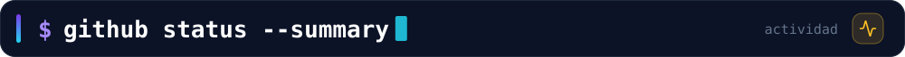

  
  
  
  

  
  

 

  


 

